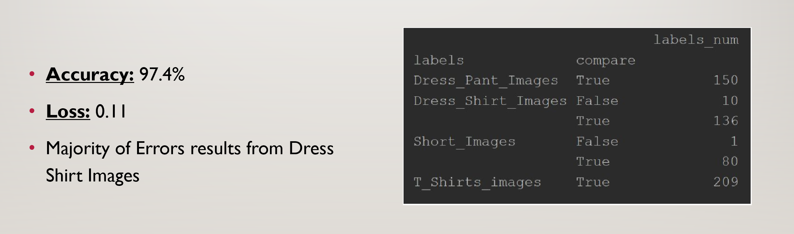

# Clothing_Image_Classification

This repository is to create a model to start identifying clothing items. My hope is that this model can be used to create an "economically feasible" (aka cheaper) automated folding machine. Current automated folding machines are tedious and expensive. I hate folding clothes but I not willing to cough up $700+ Other applications can be a clothing inventory like at Goodwill or your closet.

## Getting Started

1. Image_Classification_Model.py: Main model which will output a H5 file (image_model.h5)
2. Model_Test.py: Applying the model to a set of test clothing pictures and output a pivot to understand performance of model
3. Cloth Images.zip: About 550 Images separated by clothing type (folder names will be used for labelling)

### Prerequisites

What things you need to install the software and how to install them

1. Python 3.6
2. Keras 2.2.4
3. OpenCV 3.3.1
4. Windows 10 (can be applied on Linux but Matplotlib was not working for me on Linux)

### Installing

1. Clone Repository and unzip clothing imaging files
2. Rename Clothing Image Source within both python scripts to match your image paths

Simple installation process. I also used opencv2 to use my laptop's webcam in addition to images stored on computer to test model. 

### Approach

1. Images Collection and Loading: Only images of cloths (without any human inside the cloths). Important because my model is supposed to be used post dryer step. I used GLOB to retrieve the file paths and then created a numpy array to flatten the pixels into the RGB layers per image. Lastly, resized all the images to 224 by 224 then used the file labels to train the model.

        for image_path in tqdm.tqdm(list(
                glob.glob('C:/Users/npshe/PycharmProjects/Clothing-Classification/Cloth Images/**/*.*'))):
            fpaths.append(image_path)

        for fpath in fpaths:
            img = cv2.imread(fpath, flags=1)
            image_resize = cv2.resize(img, (image_size, image_size), interpolation=cv2.INTER_AREA)
            image_list.append(image_resize)
            labels.append(fpath.split('\\')[-2])

2. Model: Transfer learning on VGG16 model and imagenet weights. Then I applied my own layers to consolidate model to detect my labels. You may also notice that I separated the images into RGB layers because my hope is to utilize the colors to identify additional features of clothing. While this is a noticable performance cost, it should pay off for future applications.

        vgg_conv = VGG16(include_top=False, weights='imagenet', input_tensor=None, input_shape=(3, 224, 224), pooling=None)

3. Model pt 2: VGG16 and imagenet was used to classify many different images. I just want to classify 4 different types of cloths, so I had to add my own CNN layers and then pool the images. This can be altered based on the amount of labels that are created for this model.

4. Data Augmentation: Based on Step 5 of referenced url, I needed this step because the application would deal with unfolded cloths. Therefore, I needed my model to detect the cloths in a variety of formats. Source: https://medium.com/nybles/create-your-first-image-recognition-classifier-using-cnn-keras-and-tensorflow-backend-6eaab98d14dd

                            datagen = ImageDataGenerator(
                                    rotation_range=40,
                                    width_shift_range=0.2,
                                    height_shift_range=0.2,
                                    shear_range=0.2,
                                    zoom_range=0.2,
                                    horizontal_flip=True,
                                    fill_mode='nearest')

### Results

## Next Steps

1. Continue adding to images
2. Expand labels to recognize fabrics and additional types of clothing
3. Research on misclassified images to increase accuracy
4. Implement using YOLO so I can create real time image classification

## License

This project is licensed by nobody :) 
